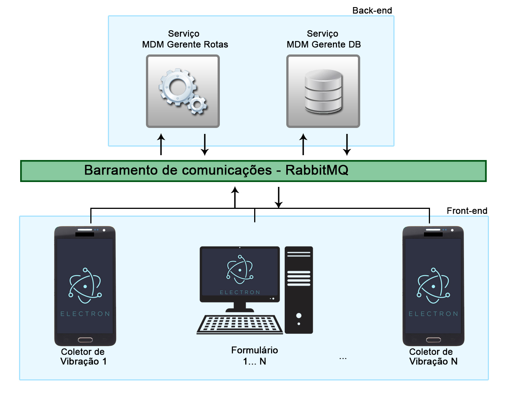

# Relatório mensal - Abril de 2020

## 1 - migração de tecnologia do coletor (continuação)

O foco principal do mês de abril foi a continuação da migração da tecnologia de desenvolvimento dos módulos envolvidos na aplicação de coleta off-line.

### 1.1 - Migração da tecnologia do coletor: Módulos "Coletor vibração" e "Formulário"

Acompanhando a evolução do coletor dos módulos mobile (Android e iOS), o módulo de coleta Windows também será migrado para uma nova tecnologia, denominada Electron.\
O Electron é uma plataforma para desenvolvimento de aplicações utilizando tecnologias web, dentre as quais podemos destacar o HTML5 e o Javascript.\
Inicialmente, a aplicação será focada em ambiente Windows, porém o Electron permite também gerar distribuições para macOS e Linux.

Dentre as vantagens da tecnologia, podemos destacar:
- Facilidade na distribuição da aplicação em diferentes plataformas;
- Aplicações nativas em diferentes sistemas operacionais;
- Ótima integração entre APIs nativas do Sistema Operacional, como câmera, microfone, janelas nativas e sistema de arquivos;
- Utiliza tecnologias há muito consolidadas no mercado de software Web, como o HTML5 e o Javascript.

### 1.2 - Bootstrap

O bootstrap é um projeto de código aberto, inicialmente desenvolvido especificamente para o Twitter. É uma dos mais populares e sólidas estruturas de front-end de HTML, CSS e JavaScript para desenvolvimento responsivo.\
Com o bootstrap é possível para criar botões, formulários, tabelas, dropdowns e muito mais. Seus padrões seguem os princípios de usabilidade e as tendências de design para interfaces.

Vantagens da utilização do boostrap:
- Biblioteca de componentes
- Reuso de código
- Padrão visual
- Responsividade

## 2 - Arquitetura

A arquitetura será a mesma utilizada pelos coletores mobile (Android/iOS).

O código da aplicação também será, em sua grande parte, compartilhado entre as plataformas.

A arquitetura é a ilustrada abaixo:

## 3 - Quem está utilizando esta tecnologia?

Um número crescente de aplicativos para desktop já estão disponíveis nesta plataforma, destacando-se:

- Discord
- Gitbhub desktop
- Whatsapp desktop
- Skype
- Visual Studio Code
- Insomnia
- Twitch
- Microsoft Teams

## 4 - Capturas de tela

